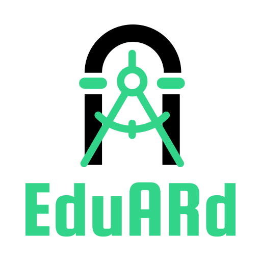

# Edu*AR*d

Cross-platform solution for 3D scan sharing. 
Breathtaking and bewitching software based on Google ARCore library for
teachers, students, scientists who want to share their technical solutions and
enhance the learning process with the help of Augmented Reality.

## Wanna look wider?
Take your complex structures, mechanisms, and tools with you. Have no obstacles
to ogle any scanned object with impressive realism. Rotate and scale the 3D model to
go deeper and learn more. Attach a video to make it clear and to share more knowledge.

## Getting started
All requirements and instructions to host and deploy project services are **inside related
folders** with source code:
- ```frontend``` responsible for admin panel written on ```Angular.js```.
- ```backend``` is a RESTful API with a ```Swagger``` documentation.
- ```application``` - the apple of our product. **Unity** app with Augmented Reality content.

## Screenshots

-----------------
.jpg)
Developed especially for the HUCUTHON event in 2021 by **Softweird Team**.
